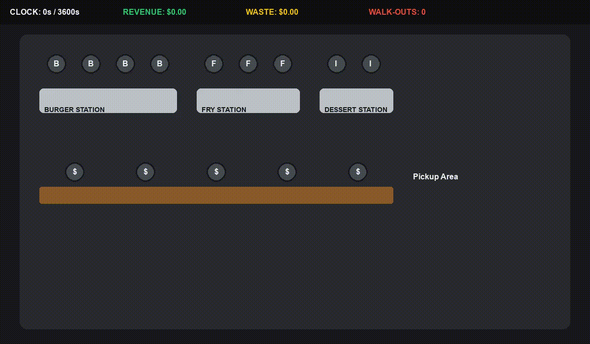

# 🍔 Fast Food Simulation & AI Optimization

[](https://www.python.org/downloads/)
[](https://stable-baselines3.readthedocs.io/)
[](https://www.docker.com/)
[](https://medium.com/@your_username/your-article-link)

This project is a high-fidelity **Discrete-Event Simulation (DES)** of a high-volume fast-food kitchen built with **SimPy**. It features an autonomous staffing and inventory optimization engine powered by **Optuna**, and a custom **Reinforcement Learning (RL)** environment compatible with **Gymnasium** to train AI kitchen managers using Maskable PPO.

📖 **Read the full technical breakdown on Medium:** [Optimizing Production-Line Management using Python](https://medium.com/@maxime.szymanski/optimizing-production-line-management-using-python-502843113e4a)

## 🎥 Trained RL Agent Performance


## 🏗 Project Structure

The repository is organized into a modular `src` package to separate simulation logic, optimization, and AI training:

* **`src/sim/`**: Contains the core discrete-event simulation logic.
    * `restaurant.py`: Defines the `FastFoodRestaurant` class, including human resources (cashiers, cooks) and physical inventory (shelves).
    * `processes.py`: Manages the stochastic logic, including non-stationary customer arrivals (Poisson), cooking loops, and the active waste management system.
* **`src/rl/`**: The Reinforcement Learning suite.
    * `FastFoodEnv.py`: A Gymnasium-wrapped environment utilizing Action Masking, normalized observations, and delta-based reward shaping.
    * `train_ppo.py`: The entry point for training the Stable-Baselines3 agent.
* **`src/optimization/`**: Hyperparameter tuning using Optuna to maximize expected restaurant profit.
* **`tests/`**: A comprehensive `pytest` suite validating the physics engine and RL environment compliance.

## 🚀 Key Code Snippets

### 1. The Active Waste Manager
This process monitors the freshness of perishable inventory and handles waste calculation, preventing the RL agent from cheating the system by over-producing food.

```python
def inventory_manager(env, restaurant, stats):
    """Continuously checks shelves and throws away expired food immediately."""
    while True:
        yield env.timeout(10.0) # Align with AI step interval

        # Logic for Burger Expiration
        valid_burgers = []
        for item in restaurant.burger_shelf.items:
            if env.now - item.creation_time > BURGER_SHELF_LIFE:
                stats["wasted_burgers"].append(1)
            else:
                valid_burgers.append(item)
        restaurant.burger_shelf.items = valid_burgers
```

### 2. Action Masking Logic

Standard RL algorithms fail in DES environments by attempting to send commands to busy workers. Masking dynamically filters out invalid actions, drastically speeding up convergence.

```python
def action_masks(self):
    """Generates a boolean mask indicating which actions are currently valid."""
    idle_b = self.num_burger_cooks - self.restaurant.burger_cook.count
    idle_f = self.num_fries_cooks - self.restaurant.fries_cook.count
    idle_i = self.num_ice_cream_cooks - self.restaurant.ice_cream_cook.count

    return np.array([
        True, idle_b > 0, 
        True, idle_f > 0, 
        True, idle_i > 0
    ], dtype=bool)
```

## 🛠 Usage & Installation

### Option 1: Docker (Recommended for Training)
The most efficient way to run the headless hyperparameter tuning and AI training is via the containerized pipeline. 

```bash
# Build the images
docker compose build

# Run the training and reporting containers in the background
docker compose up -d

# Monitor the training progress live
tensorboard --logdir ./tb_logs/
```

### Option 2: Local Setup (Required for Pygame GUI)

To watch the trained agent manage the kitchen in real-time, the project must be run locally to allow Pygame to access your machine's display drivers.

Ensure you are using Python 3.10+.

```bash
# Clone the repository
git clone [https://github.com/yourusername/fast-food-rl.git](https://github.com/yourusername/fast-food-rl.git)
cd fast-food-rl

# Set up a virtual environment
python -m venv venv
source venv/bin/activate  # Windows: venv\Scripts\activate

# Install dependencies
pip install -r requirements.txt
```

## 🧪 Execution Commands

### Run the Test Suite (26 core tests):

```bash
python -m pytest tests/
```

### Run Optuna Staffing Optimization:

```bash
python -m src.optimization.optimize
```

### Train the Maskable PPO Agent:

```bash
python -m src.rl.train_ppo
```

## 💻 Tech Stack

* **Simulation Engine:** [SimPy](https://simpy.readthedocs.io/) (Discrete-Event Simulation)
* **Reinforcement Learning:** [Gymnasium](https://gymnasium.farama.org/), [Stable-Baselines3](https://stable-baselines3.readthedocs.io/), [SB3-Contrib](https://github.com/Stable-Baselines-Team/stable-baselines3-contrib)
* **Hyperparameter Optimization:** [Optuna](https://optuna.org/)
* **GUI & Visualization:** [Pygame](https://www.pygame.org/), [TensorBoard](https://www.tensorflow.org/tensorboard)
* **Data Science:** NumPy, Pandas, Matplotlib
* **DevOps:** Docker, Docker Compose, Pytest

---

## 🤝 Contributing

Contributions, issues, and feature requests are welcome! Feel free to check the [issues page](https://github.com/yourusername/fast-food-rl/issues) if you want to contribute to the digital twin's complexity or improve the reward shaping logic.

## 📄 License

Distributed under the MIT License. See `LICENSE` for more information.

---
*Developed by [Maxime Szymanski](https://github.com/MaximeSzymanski)*
