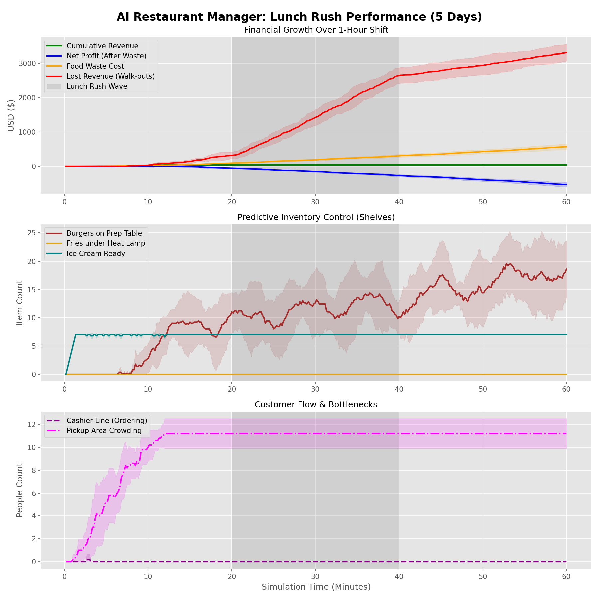

Project Overview
================

**FastFoodSim** is a sophisticated Discrete-Event Simulation (DES) designed to model the operational complexity of high-volume food service. It serves as a benchmark for Reinforcement Learning (RL) agents tasked with real-time resource management.

.. note::
   This project was designed to bridge the gap between pure algorithmic RL and real-world Operations Research (OR) constraints.

System Architecture
-------------------
The core simulation engine is powered by **SimPy**. Unlike standard "step-based" games, every action in this environment has a temporal cost.

* **Non-Stationary Poisson Process**: Customer arrivals follow a dynamic rate that peaks during the "Lunch Rush" (20–40 minute mark).
* **Stochastic Service Times**: Cashier interactions and burger cooking utilize triangular distributions to simulate human variability.

.. hint::
   Look at the "Predictive Inventory Control" plot above. A successful agent begins stockpiling burgers at minute 18, just before the gray rush window begins.
